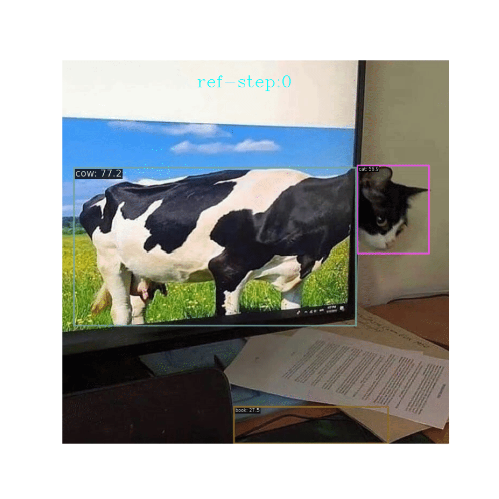

# DEQDet

This is the official code implementation for  ICCV23 paper [Deep Equilibrium Object Detection](https://arxiv.org/abs/2308.09564).

## Introduction

we extend DEQ model to Query-based object detector through formulating the refinement process of decoder as  *fixed-point* iteration.


**TL;DR**   Query-based object detectors directly decode image features into object instances with a set of learnable queries. These query vectors are progressively refined to stable meaningful representations through a sequence of decoder layers, and then used to directly predict object locations and categories with simple FFN heads. In this paper, we present a new query-based object detector (DEQDet) by designing a deep equilibrium decoder. Our DEQ decoder models the query vector refinement as the fixed point solving of an **implicit** layer and is equivalent to applying **infinite** steps of refinement. To be more specific to object decoding, we use a two-step unrolled equilibrium equation to explicitly capture the query vector refinement. Accordingly, we are able to incorporate refinement awareness into the DEQ training with the inexact gradient back-propagation (RAG). In addition, to stabilize the training of our DEQDet and improve its generalization ability, we devise the deep supervision scheme on the optimization path of DEQ with refinement-aware perturbation~(RAP). Our experiments demonstrate DEQDet converges faster, consumes less memory, and achieves better results than the baseline counterpart (AdaMixer). In particular, our DEQDet with ResNet50 backbone and 300 queries achieves the 49.5 mAP and 33.0 AP*s* on the MS COCO benchmark under 2× training scheme (24 epochs).     


## Model Released
The pretrained models can be found in [release page](https://[test.py](tools%2Ftest.py)github.com/MCG-NJU/DEQDet/releases/tag/detection_weights). 

| detector    | backbone | mAP            | mAP50     | mAP75           | ckpt                                                                                                          |
|-------------|----------|----------------|-----------|-----------------|---------------------------------------------------------------------------------------------------------------|
| deqdet(2x)  | r50      | 49.6           | 68.0      | 54.0            | [download](https://github.com/MCG-NJU/DEQDet/releases/download/detection_weights/deqdet_r50_2x_epoch_24.pth)  |
| deqdet(2x)  | r101     | 50.5           | 69.1      | 55.0            | [download](https://github.com/MCG-NJU/DEQDet/releases/download/detection_weights/deqdet_r101_2x_epoch_24.pth) |
| deqdet(2x)  | swins    | 54.0 | 73.4| 58.9            | [download](https://github.com/MCG-NJU/DEQDet/releases/download/detection_weights/deqdet_swins_2x_epoch_24.pth)                                 |
| deqdet(1x)  | r50      | 46.0 | 64.8|  49.6| [download](https://github.com/MCG-NJU/DEQDet/releases/download/detection_weights/deqdet_r50_1x_epoch_12.pth)                                    

## Train and Evaluate
The training script is as same as mmdetection code base. Thus before exploring DEQDet, install mmdetection first.
to train deqdet armed with R50 under 2x setting
```shell
bash tools/dist_train.sh projects/configs/eqdet_r50_2x_coco.py 8 
```

for test
```shell
bash tools/dist_test.sh projects/configs/eqdet_r50_2x_coco.py deqdet_r50_2x_epoch_24.pth 8
```
## Notebook and visualization
The convergence stablity in *fix-point* iteration looks like:

| relative error in iteration                | absolute error in iteration |
|--------------------------------------------|-----------------------------|
|  |  |

A visualization notebook is also provided to demonstrate the detection power of deqdet.

| original image                 | deqdet with R50                           | deqdet with R101                           | deqdet with swins                           |
|--------------------------------|-------------------------------------------|--------------------------------------------|---------------------------------------------|
|  |  |  |  |
|  |  |  |  |
## Acknowledgement

* object detection: [AdaMixer](https://github.com/MCG-NJU/AdaMixer), [mmdetection](https://github.com/open-mmlab/mmdetection)
* DEQ model: [DEQ-Flow](https://github.com/locuslab/deq-flow), [DEQ-tutorial](http://implicit-layers-tutorial.org/deep_equilibrium_models/)

